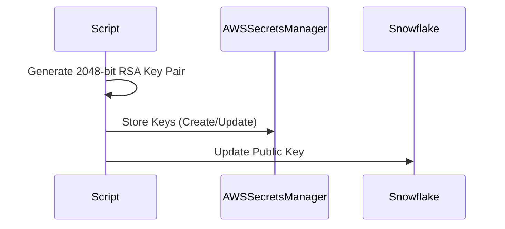

# Asymmetric Key Rotator

This Python script automates the rotation of asymmetric PEM key pairs used by Snowflake Service Accounts for authentication. It handles the complete lifecycle of key rotation including generation, secure storage in AWS Secrets Manager, and Snowflake user updates.

## Features

- Generates 2048-bit RSA key pairs with strong encryption
- Securely stores keys in AWS Secrets Manager
- Automatically updates Snowflake user credentials
- Comprehensive logging with rotation support
- AWS KMS integration for additional security


## Prerequisites

- Python 3.x
- AWS API Access with permissions to 
   - AWS Secrets Manager
   - AWS KMS
- Snowflake account with admin privileges
- [uv](https://github.com/astral-sh/uv) - Modern Python package installer

## Installation

1. Clone the repository
2. Install and run using uv:
```bash
uv run main.py
```

Dependencies are automatically managed through inline script declarations:

main.py:
```python
# /// script
# dependencies = [
#     "boto3",
#     "botocore",
#     "python-dotenv"
# ]
# ///
```

## Configuration

### AWS Configuration

1. Configure AWS credentials with access to Secrets Manager
2. Update `secrets_config.yml` with your settings:
```yaml
kms_key_arn: "your-kms-key-arn"
secrets_manager_name: "your-secrets-config-name"
```

### Environment Variables

Create a `.env` file with required variables:
```
AWS_ACCESS_KEY_ID=<add-your-access-id>
AWS_SECRET_ACCESS_KEY=<add-your-access-secret>
```

### Snowflake Configuration

Ensure your Snowflake service account has the necessary permissions to:
- Create and manage key pairs
- Update user authentication settings
- Access required databases and schemas

## Usage

The following sequence diagram illustrates the key rotation process:



1. Generate new key pairs:
```bash
uv run create_asymetric_keys.py
```
This will create:
- `keys/private_key.pem`: Encrypted private key
- `keys/public_key.pem`: Public key

2. Run the key rotation script:
```bash
uv run main.py
```

The script will:
1. Generate new PEM key pairs
2. Store the PEM keys in AWS Secrets Manager
   - Update existing secret if it exists
   - Create new secret if it doesn't exist
3. Update the Snowflake user with the new public PEM key

## Logging

The application uses a comprehensive logging system that includes:
- Console output for immediate feedback
- Rotating file logs stored in `logs/app.log`
- Log rotation at 1MB with 3 backup files maintained
- Timestamp and log level information
- Detailed error tracking
